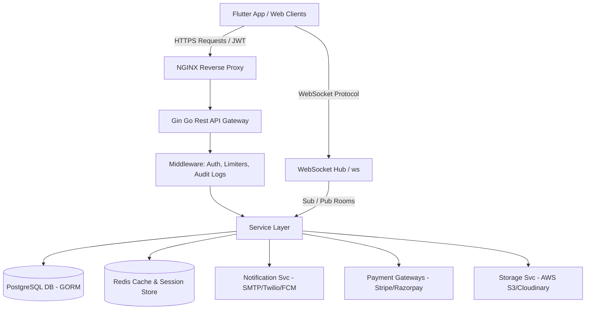
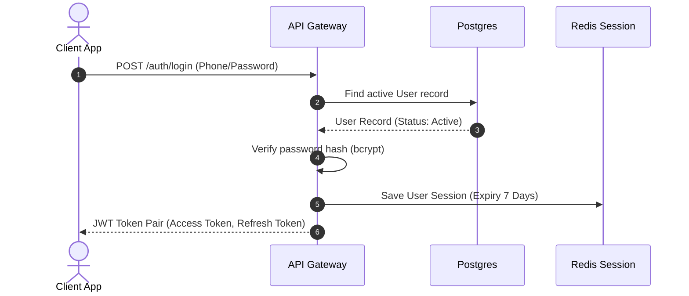
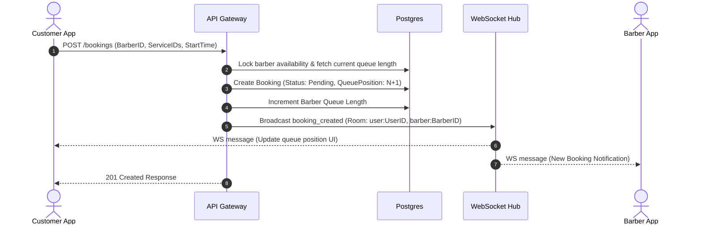
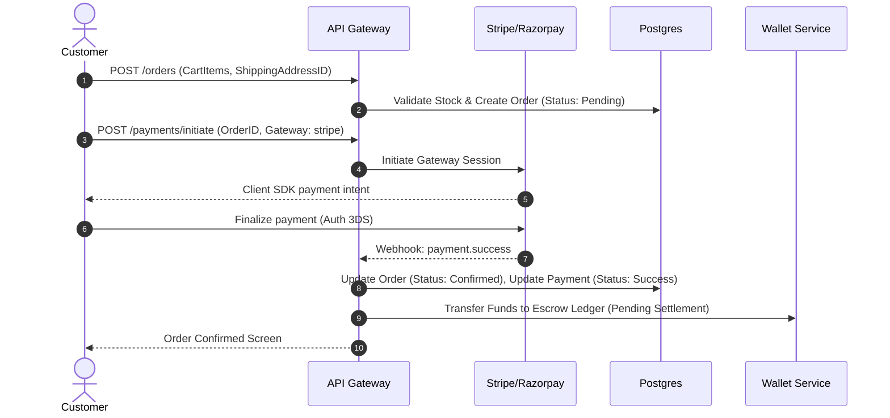
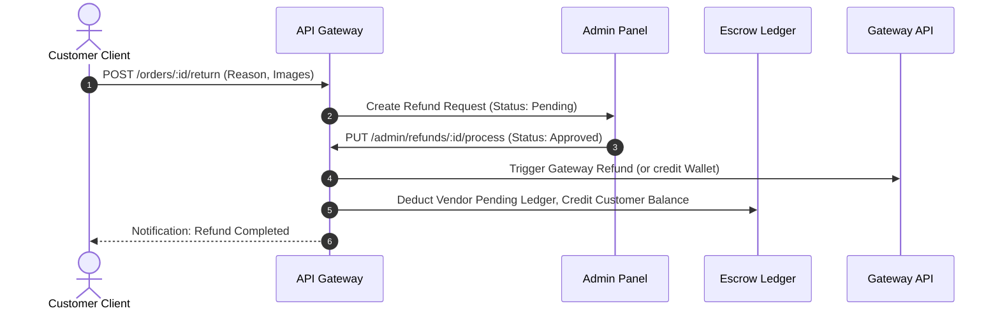

# Barbar App - Backend API & System Architecture Documentation

This document serves as the complete, production-ready specification of the Barbar App backend system. It contains all the necessary information, JSON schemas, endpoints, business rules, and state management guides required by Flutter developers to build the complete frontend client application without needing to inspect the backend Go source code.

---

## 1. PROJECT OVERVIEW

### 1.1 Project Summary
The **Barbar App** is a dual-purpose hyperlocal service and marketplace platform. It enables customers to discover nearby barbers, book appointments, track real-time virtual queues, and purchase professional grooming and beauty products from registered vendors.

*   **Business Overview**: Monetization occurs via a commission model (10% standard platform commission on vendor sales, custom commissions for premium services), booking convenience fees, and featured listing advertisements.
*   **Platform Overview**: The system consists of four primary components:
    1.  **Customer App**: Mobile client for discovering salons/barbers, booking services, checking wait times, managing the wallet, and buying products.
    2.  **Barber App**: Mobile/web dashboard for managing queues, updating availability schedules, managing salon profiles, tracking earnings, and verifying walk-ins.
    3.  **Vendor Console**: Mobile/web console for listing grooming products, processing orders, managing inventory, and requesting payouts.
    4.  **Admin Console**: Operations panel for moderating users/listings, executing KYC checks, settling disputes, modifying global fees, and monitoring platform metrics.
*   **Main Modules**:
    *   **Authentication & Session Management**: OTP-based telephone login, password login, JWT token pair flow, and role assignments.
    *   **Hyperlocal Directory**: Location-indexed search and recommendations for barbers and products within a specific radius.
    *   **Virtual Queue & Booking Engine**: Live-calculated queue placement, no-show automated purging, dynamic wait-time estimation, and service modifications.
    *   **Marketplace & Inventory**: Standard checkout, multi-vendor cart routing, live inventory allocation, return/refund processing, and shipping tracking.
    *   **Wallet & Escrow Engine**: Integrated virtual ledger supporting customer refunds, vendor earnings escrow, admin commission splitting, and withdrawal settlement.
    *   **Realtime PubSub Node**: WebSocket hub routing status updates, queue positions, and push alerts.

---

### 1.2 System Architecture Diagram
The architecture is designed for high concurrency, combining a Gin REST API gateway with a stateful Gorilla WebSockets server backed by PostgreSQL (persistence) and Redis (caching, rate-limiting, and session locks).



---

### 1.3 High-Level Data Flows

#### 1.3.1 Authentication Flow
Customers and service partners authenticate via phone/OTP or email/password. Refresh tokens are stored locally on the device (secure storage) to maintain active sessions.



#### 1.3.2 Booking & Queue Flow
A customer books a service. The scheduling engine determines the starting queue position and estimates wait times based on historical slot duration.



#### 1.3.3 Marketplace Purchase & Wallet Splicing
Standard checkout routes order funds through an escrow engine, deducting commissions before allocating balances.



#### 1.3.4 Dispute & Refund Flow
When an order or booking is cancelled, funds are reversed from vendor ledger entries or escrow accounts to the customer's wallet or original payment gateway.



---

## 2. USER ROLES

The platform enforces strict role-based access control (RBAC) via JWT claims check middleware.

| Role | Capabilities | Permissions | Restrictions |
| :--- | :--- | :--- | :--- |
| **Customer** | Discover partners, book salon services, join virtual queues, add items to cart, checkout products, review services/items. | Edit personal profile, register devices, manage addresses, modify pending bookings, cancel unpaid bookings. | Cannot view barber calendars, update product listings, approve withdrawal requests, or access other users' data. |
| **Barber** | Manage salon profile, add services, configure weekly availability/holidays, process queues, complete bookings, register walk-ins. | Modify booking status (in-progress, completed, no-show), view salon queue analytics, manage own bank accounts. | Restricted from accessing product inventory of vendors, altering commissions, or viewing global system configurations. |
| **Vendor** | Manage store details, create and update product listings, manage inventory, view orders, update order shipping status. | Request wallet payouts, add vendor bank accounts, upload store documents. | Cannot offer salon services, access barber schedules, or access global admin analytical panels. |
| **Delivery Partner** | Track order packages, map routing locations, update transit status (shipped, out_for_delivery, delivered). | Access shipping address fields, read order items, sign off package delivery. | Cannot access billing details, edit inventory, manage wallet payout methods, or update dispute statuses. |
| **Super Admin** | Manage all roles, moderate listings, approve KYC documents, resolve disputes, toggle feature flags, configure taxes/fees. | Read audit logs, export analytical reports, execute manual payouts, override system settings. | None. Must strictly operate within compliance and security guidelines. |

---

## 3. API DOCUMENTATION

All requests must send `Accept: application/json` and `Content-Type: application/json` unless uploading files. Protected endpoints require the `Authorization: Bearer <JWT_ACCESS_TOKEN>` header.

### 3.1 Public Directory Endpoints

#### 3.1.1 List Nearby Barbers
*   **Method**: `GET`
*   **URL**: `/api/v1/public/barbers`
*   **Purpose**: Fetch all active, nearby salons based on geolocation coordinates.
*   **Auth Required**: No.
*   **Request Parameters (Query)**:
    *   `latitude` (float, required): Latitude of customer location (e.g. `12.9716`).
    *   `longitude` (float, required): Longitude of customer location (e.g. `77.5946`).
    *   `radius` (int, optional): Search radius in meters. Defaults to `5000` (5km). Max `25000`.
    *   `search` (string, optional): Query string to filter by salon/shop name.
    *   `page` (int, optional): Defaults to `1`.
    *   `page_size` (int, optional): Defaults to `20`.
*   **Success Response (200 OK)**:
    ```json
    {
      "success": true,
      "data": [
        {
          "id": "c0a80101-8fc2-11eb-8dcd-0242ac130003",
          "shop_name": "Premium Barber Shop",
          "shop_description": "Elite styling services",
          "shop_image": "http://localhost:8080/uploads/barber_main.jpg",
          "address": "123 Main Road, Indiranagar",
          "city": "Bengaluru",
          "latitude": 12.9716,
          "longitude": 77.5946,
          "rating": 4.8,
          "review_count": 142,
          "is_available": true,
          "current_queue_length": 3,
          "average_wait_time": 45.0
        }
      ],
      "meta": {
        "page": 1,
        "limit": 20,
        "total": 1
      }
    }
    ```
*   **Frontend Note**: Cache the response key `public_barbers_list` locally for 5 minutes. Invalidate cache on pull-to-refresh.

#### 3.1.2 Get Barber Profile
*   **Method**: `GET`
*   **URL**: `/api/v1/public/barbers/:id`
*   **Purpose**: Get full profile details of a single barber shop.
*   **Auth Required**: No.
*   **Success Response (200 OK)**:
    ```json
    {
      "success": true,
      "data": {
        "id": "c0a80101-8fc2-11eb-8dcd-0242ac130003",
        "user_id": "9b1deb4d-3b7d-4bad-9bdd-2b0d7b3dcb6d",
        "shop_name": "Premium Barber Shop",
        "shop_description": "Elite styling services",
        "shop_image": "http://localhost:8080/uploads/barber_main.jpg",
        "phone": "+919999999999",
        "address": "123 Main Road, Indiranagar",
        "city": "Bengaluru",
        "rating": 4.8,
        "review_count": 142,
        "start_time": "09:00",
        "end_time": "21:00",
        "max_queue_size": 50,
        "current_queue_length": 3,
        "average_wait_time": 45.0
      }
    }
    ```

---

### 3.2 Authentication & User Endpoints

#### 3.2.1 Register User
*   **Method**: `POST`
*   **URL**: `/api/v1/auth/register`
*   **Purpose**: Register a new user role (customer, barber, or vendor).
*   **Auth Required**: No.
*   **Request Body**:
    ```json
    {
      "full_name": "John Doe",
      "email": "johndoe@example.com",
      "phone": "+919999999999",
      "password": "Password123!",
      "role": "customer"
    }
    ```
*   **Validation Rules**:
    *   `full_name`: Required, minimum length 2, max 255.
    *   `email`: Optional, must be valid email format.
    *   `phone`: Required, must include country code (+91), min length 10.
    *   `password`: Required, minimum 8 characters.
    *   `role`: Must be one of `customer`, `barber`, `vendor`.
*   **Success Response (201 Created)**:
    ```json
    {
      "success": true,
      "data": {
        "user": {
          "id": "9b1deb4d-3b7d-4bad-9bdd-2b0d7b3dcb6d",
          "email": "johndoe@example.com",
          "phone": "+919999999999",
          "full_name": "John Doe",
          "role": "customer",
          "status": "active"
        },
        "tokens": {
          "access_token": "eyJhbGciOi...",
          "refresh_token": "eyJhbGciOi..."
        }
      }
    }
    ```
*   **Error Response (400 Bad Request)**:
    ```json
    {
      "success": false,
      "error": "User with this email or phone already exists"
    }
    ```

#### 3.2.2 Send OTP
*   **Method**: `POST`
*   **URL**: `/api/v1/auth/otp/send`
*   **Purpose**: Trigger verification code via Twilio SMS to verify user phone number.
*   **Auth Required**: No. (Rate-limited to 10 requests per minute by IP).
*   **Request Body**:
    ```json
    {
      "phone": "+919999999999"
    }
    ```
*   **Success Response (200 OK)**:
    ```json
    {
      "success": true,
      "data": {
        "message": "OTP sent successfully"
      }
    }
    ```

#### 3.2.3 Verify OTP
*   **Method**: `POST`
*   **URL**: `/api/v1/auth/otp/verify`
*   **Purpose**: Submit OTP verification code. If successful, yields JWT credentials.
*   **Auth Required**: No.
*   **Request Body**:
    ```json
    {
      "phone": "+919999999999",
      "otp": "123456"
    }
    ```
*   **Success Response (200 OK)**:
    ```json
    {
      "success": true,
      "data": {
        "user": {
          "id": "9b1deb4d-3b7d-4bad-9bdd-2b0d7b3dcb6d",
          "phone": "+919999999999",
          "otp_verified": true
        },
        "tokens": {
          "access_token": "eyJhbGciOi...",
          "refresh_token": "eyJhbGciOi..."
        }
      }
    }
    ```

#### 3.2.4 Refresh Tokens
*   **Method**: `POST`
*   **URL**: `/api/v1/auth/refresh`
*   **Purpose**: Get new Access Token using active Refresh Token.
*   **Auth Required**: No.
*   **Request Body**:
    ```json
    {
      "refresh_token": "eyJhbGciOi..."
    }
    ```
*   **Success Response (200 OK)**:
    ```json
    {
      "success": true,
      "data": {
        "tokens": {
          "access_token": "eyJhbGciOi...",
          "refresh_token": "eyJhbGciOi..."
        }
      }
    }
    ```

---

### 3.3 Customer Booking & Queue Endpoints

#### 3.3.1 Create Booking
*   **Method**: `POST`
*   **URL**: `/api/v1/bookings`
*   **Purpose**: Book an appointment with a barber salon. Automatically increments queue size.
*   **Auth Required**: Yes.
*   **Role Access**: `customer`
*   **Request Body**:
    ```json
    {
      "barber_id": "c0a80101-8fc2-11eb-8dcd-0242ac130003",
      "service_ids": ["d2b90202-8fc2-11eb-8dcd-0242ac130003"],
      "scheduled_start": "2026-06-04T10:00:00Z",
      "customer_notes": "Urgent styling"
    }
    ```
*   **Success Response (201 Created)**:
    ```json
    {
      "success": true,
      "data": {
        "id": "a0f2c4d6-8fc2-11eb-8dcd-0242ac130003",
        "barber_id": "c0a80101-8fc2-11eb-8dcd-0242ac130003",
        "customer_id": "9b1deb4d-3b7d-4bad-9bdd-2b0d7b3dcb6d",
        "status": "pending",
        "scheduled_start": "2026-06-04T10:00:00Z",
        "scheduled_end": "2026-06-04T10:30:00Z",
        "queue_position": 4,
        "estimated_wait_minutes": 45,
        "total_price": 500.0,
        "final_price": 500.0,
        "payment_status": "pending"
      }
    }
    ```

#### 3.3.2 Get My Queue Position
*   **Method**: `GET`
*   **URL**: `/api/v1/barber/queue/:booking_id`
*   **Purpose**: Get live queue status, wait times, and people ahead of the customer.
*   **Auth Required**: Yes.
*   **Role Access**: `customer`
*   **Success Response (200 OK)**:
    ```json
    {
      "success": true,
      "data": {
        "booking_id": "a0f2c4d6-8fc2-11eb-8dcd-0242ac130003",
        "current_position": 2,
        "people_ahead": 1,
        "estimated_wait_min": 15,
        "status": "confirmed",
        "scheduled_start": "2026-06-04T10:00:00Z"
      }
    }
    ```

---

### 3.4 Barber Service & Queue Management

#### 3.4.1 Update Booking Status
*   **Method**: `PUT`
*   **URL**: `/api/v1/barber/bookings/:id/status`
*   **Purpose**: Advance the queue status when starting/completing a styling service.
*   **Auth Required**: Yes.
*   **Role Access**: `barber`
*   **Request Body**:
    ```json
    {
      "status": "in_progress",
      "notes": "Starting wash"
    }
    ```
*   **Validation Rules**:
    *   `status`: Must be one of `confirmed`, `in_progress`, `completed`, `no_show`.
*   **Success Response (200 OK)**:
    ```json
    {
      "success": true,
      "data": {
        "id": "a0f2c4d6-8fc2-11eb-8dcd-0242ac130003",
        "status": "in_progress",
        "actual_start": "2026-06-03T18:30:00Z"
      }
    }
    ```
*   **Realtime Update Note**: Triggers `queue_position_changed` WebSocket message to all customers in the queue, reducing their wait times.

---

### 3.5 Vendor & Marketplace Endpoints

#### 3.5.1 Create Product
*   **Method**: `POST`
*   **URL**: `/api/v1/products`
*   **Purpose**: Register a new product listing.
*   **Auth Required**: Yes.
*   **Role Access**: `vendor`
*   **Request Body**:
    ```json
    {
      "category_id": "11111111-8fc2-11eb-8dcd-0242ac130003",
      "name": "Organic Hair Wax",
      "description": "Premium strong hold wax",
      "base_price": 600.0,
      "discount_price": 500.0,
      "tax_percent": 18.0,
      "total_stock": 100,
      "has_variants": false,
      "images": [
        {
          "image_url": "http://localhost:8080/uploads/wax.jpg",
          "alt_text": "Hair Wax",
          "is_primary": true
        }
      ]
    }
    ```
*   **Success Response (201 Created)**:
    ```json
    {
      "success": true,
      "data": {
        "id": "e3c80101-8fc2-11eb-8dcd-0242ac130003",
        "name": "Organic Hair Wax",
        "base_price": 600.0,
        "discount_price": 500.0,
        "discount_percent": 16.67,
        "available_stock": 100,
        "is_approved": false,
        "is_active": false
      }
    }
    ```

#### 3.5.2 Place Order
*   **Method**: `POST`
*   **URL**: `/api/v1/orders`
*   **Purpose**: Place a marketplace order for items in the cart.
*   **Auth Required**: Yes.
*   **Role Access**: `customer`
*   **Request Body**:
    ```json
    {
      "vendor_id": "f5f2c4d6-8fc2-11eb-8dcd-0242ac130003",
      "shipping_address_id": "d0d2c4d6-8fc2-11eb-8dcd-0242ac130003",
      "billing_address_id": "d0d2c4d6-8fc2-11eb-8dcd-0242ac130003",
      "coupon_code": "WAX10"
    }
    ```
*   **Success Response (200 OK)**:
    ```json
    {
      "success": true,
      "data": {
        "id": "f1f2c4d6-8fc2-11eb-8dcd-0242ac130003",
        "order_number": "ORD-20260603-9A1C",
        "status": "pending",
        "items_total": 500.0,
        "shipping_charge": 50.0,
        "tax_amount": 90.0,
        "discount_amount": 50.0,
        "final_amount": 590.0,
        "payment_status": "pending"
      }
    }
    ```

---

### 3.6 Wallet & Ledger Transactions

#### 3.6.1 Request Withdrawal
*   **Method**: `POST`
*   **URL**: `/api/v1/wallet/withdrawals`
*   **Purpose**: Request payout of settled earnings to vendor's registered bank account.
*   **Auth Required**: Yes.
*   **Role Access**: `vendor`
*   **Request Body**:
    ```json
    {
      "amount": 5000.0,
      "bank_account_id": "a1b2c3d4-8fc2-11eb-8dcd-0242ac130003"
    }
    ```
*   **Success Response (201 Created)**:
    ```json
    {
      "success": true,
      "data": {
        "id": "b1b2c3d4-8fc2-11eb-8dcd-0242ac130003",
        "vendor_id": "f5f2c4d6-8fc2-11eb-8dcd-0242ac130003",
        "amount": 5000.0,
        "fee_amount": 100.0,
        "net_amount": 4900.0,
        "status": "pending"
      }
    }
    ```
*   **Business Rule**: Limits withdrawals to a maximum of 5 requests per month. Minimum payout request amount is ₹500. Deducts 2% processing fees.

---

### 3.7 Admin Operations

#### 3.7.1 Approve KYC Document
*   **Method**: `PUT`
*   **URL**: `/api/v1/admin/kyc-documents/:id/verify`
*   **Purpose**: Update verification state for a barber or vendor KYC submission.
*   **Auth Required**: Yes.
*   **Role Access**: `admin`, `super_admin`
*   **Request Body**:
    ```json
    {
      "status": "approved",
      "remarks": "Documents match PAN records"
    }
    ```
*   **Success Response (200 OK)**:
    ```json
    {
      "success": true,
      "data": {
        "id": "b1b2c3d4-8fc2-11eb-8dcd-0242ac130003",
        "status": "approved",
        "verified_at": "2026-06-03T18:40:00Z"
      }
    }
    ```

---

## 4. RESPONSE MODELS

Every field is detailed for Flutter data serialization layer. Nullable fields are represented with `*`.

### 4.1 User Schema
| Name | Type | Nullable | Required | Description |
| :--- | :--- | :--- | :--- | :--- |
| `id` | String | No | Yes | UUID string representing primary key |
| `email` | String | Yes | No | Unique email address |
| `phone` | String | No | Yes | Phone number including country prefix |
| `full_name` | String | No | Yes | Full profile name of user |
| `avatar` | String | Yes | No | Absolute URL to storage path for avatar image |
| `role` | String | No | Yes | User roles: `customer`, `barber`, `vendor`, `admin` |
| `status` | String | No | Yes | User status: `active`, `inactive`, `suspended`, `blocked` |
| `otp_verified` | Boolean | No | Yes | Indicates if mobile verification is completed |
| `language_pref` | String | No | Yes | Language ISO string preference. Defaults to `en` |

### 4.2 Barber Profile Schema
| Name | Type | Nullable | Required | Description |
| :--- | :--- | :--- | :--- | :--- |
| `id` | String | No | Yes | Unique UUID identifier |
| `shop_name` | String | No | Yes | Public salon store name |
| `address` | String | No | Yes | Location street address |
| `city` | String | No | Yes | Registered salon location city |
| `latitude` | Float | No | Yes | Coordinate lat position |
| `longitude` | Float | No | Yes | Coordinate lon position |
| `rating` | Float | No | Yes | Consolidated review rating score |
| `is_available` | Boolean | No | Yes | Status indicating if booking requests are accepted |
| `current_queue_length` | Int | No | Yes | Number of active pending/in-progress client bookings |

### 4.3 Booking Schema
| Name | Type | Nullable | Required | Description |
| :--- | :--- | :--- | :--- | :--- |
| `id` | String | No | Yes | Unique UUID identifier |
| `barber_id` | String | No | Yes | Linked Barber UUID |
| `customer_id` | String | No | Yes | Linked Customer UUID |
| `status` | String | No | Yes | BookingStatus enum string |
| `scheduled_start` | String | No | Yes | ISO8601 UTC timestamp for slot start |
| `scheduled_end` | String | No | Yes | ISO8601 UTC timestamp for slot end |
| `queue_position` | Int | No | Yes | Relative position inside queue sequence |
| `estimated_wait_minutes`| Int | No | Yes | Wait time until start |
| `final_price` | Float | No | Yes | Payable amount after discount coupon application |

### 4.4 Product Schema
| Name | Type | Nullable | Required | Description |
| :--- | :--- | :--- | :--- | :--- |
| `id` | String | No | Yes | Unique UUID product key |
| `vendor_id` | String | No | Yes | Linked Vendor store profile UUID |
| `name` | String | No | Yes | Marketplace item name |
| `base_price` | Float | No | Yes | Cost price of item |
| `discount_price` | Float| Yes | No | Promotional deal price |
| `available_stock` | Int | No | Yes | Physical items currently remaining |
| `is_approved` | Boolean | No | Yes | Flag marking admin approval state |

---

## 5. ENUMS

### 5.1 Booking Status
*   `pending`: Initial status on booking creation.
*   `confirmed`: Payment verified / booking accepted by barber.
*   `in_progress`: Customer checked-in; service execution started.
*   `completed`: Service finished; invoice generated.
*   `cancelled`: Cancelled by user or barber. Triggered refund check.
*   `no_show`: Customer did not arrive within 15 minutes of slot start. Reschedules queue position.

### 5.2 Order Status
*   `pending`: Order request created; waiting for payment verify.
*   `confirmed`: Paid; order routed to vendor panel.
*   `processing`: Package is being sorted and packed.
*   `shipped`: Courier partner picked up package.
*   `out_for_delivery`: Package reached local delivery center.
*   `delivered`: Delivered to shipping location. Starts return window.
*   `cancelled`: Cancelled. Payment reversed.
*   `returned`: Product returned by customer.
*   `refunded`: Total amount credited back.

### 5.3 Payment Status
*   `pending`: Payment session initiated.
*   `success`: Gateway capture verified.
*   `failed`: Decline or payment timeout.
*   `refunded`: Fully credited back.
*   `partial_refund`: Part of the multi-vendor transaction reversed.

---

## 6. FRONTEND SCREEN MAPPING

### 6.1 Customer App: Home Screen
*   **Purpose**: Discover nearby barbers, featured products, and view active bookings.
*   **Required APIs**:
    *   `GET /api/v1/public/barbers` (Filter: coordinates)
    *   `GET /api/v1/public/products/featured`
    *   `GET /api/v1/bookings` (Query status: `confirmed`, `in_progress`)
*   **Required Models**: `Barber`, `Product`, `Booking`
*   **Realtime Events**: `queue_position_changed` (Update wait time in home card).
*   **Pull To Refresh**: Enabled. Re-executes all listed APIs and flushes directory cache.
*   **Offline Behavior**: Render last cached list of salons using Local SQLite cache database.

### 6.2 Customer App: Queue Tracking Screen
*   **Purpose**: Realtime visualization of position in virtual queue line.
*   **Required APIs**:
    *   `GET /api/v1/barber/queue/:booking_id`
*   **Required Models**: `Booking`
*   **Realtime Events**:
    *   `queue_position_changed`: Update visual queue index.
    *   `booking_cancelled`: Route user to home screen showing error dialog.
*   **Empty State**: Show "No active queue placement".

---

## 7. REALTIME EVENTS

The WebSocket node is hosted at `ws://<base_url>/ws?token=<access_token>`.

### 7.1 WebSocket Events Catalog

#### 7.1.1 queue_position_changed
*   **Trigger Source**: Barber moves booking state or updates queue position.
*   **Payload Structure**:
    ```json
    {
      "type": "queue_update",
      "payload": {
        "booking_id": "a0f2c4d6-8fc2-11eb-8dcd-0242ac130003",
        "current_position": 2,
        "estimated_wait_min": 20
      }
    }
    ```
*   **Affected Roles**: `customer`
*   **Frontend Behavior**: Updates the Live Tracker indicator widget dynamically using a StreamBuilder. Emits local alert chime.

#### 7.1.2 booking_updated
*   **Payload Structure**:
    ```json
    {
      "type": "booking_update",
      "payload": {
        "booking_id": "a0f2c4d6-8fc2-11eb-8dcd-0242ac130003",
        "status": "in_progress"
      }
    }
    ```
*   **Frontend Behavior**: Triggers state transition. Redirects user dashboard showing "Active Service Started".

---

## 8. PUSH NOTIFICATIONS (FCM)

Push notifications are delivered via Firebase Cloud Messaging.

### 8.1 FCM Message Structure
*   **Priority**: High (For queue updates), Normal (Promotional campaigns).
*   **Deep Link Formats**:
    *   Booking updates: `barbar://bookings/:id`
    *   Marketplace orders: `barbar://orders/:id`
    *   Wallet credits: `barbar://wallet`
*   **Payload Payload Example**:
    ```json
    {
      "to": "FCM_DEVICE_TOKEN",
      "priority": "high",
      "notification": {
        "title": "Your turn is next!",
        "body": "Only 1 client ahead of you. Head to salon.",
        "sound": "default"
      },
      "data": {
        "click_action": "FLUTTER_NOTIFICATION_CLICK",
        "type": "queue_update",
        "booking_id": "a0f2c4d6-8fc2-11eb-8dcd-0242ac130003"
      }
    }
    ```

---

## 9. FILE UPLOADS

All image and document assets are routed to AWS S3 storage.

*   **Endpoint**: `POST /api/v1/upload/image`
*   **Max Request Size**: 10MB per image, 32MB max overall batch.
*   **Supported MIME Types**: `image/jpeg`, `image/png`, `image/webp`.
*   **Upload Response Structure (201 Created)**:
    ```json
    {
      "success": true,
      "data": {
        "file_url": "https://barbar-app-uploads.s3.ap-south-1.amazonaws.com/9b1deb4d/profile.jpg",
        "size_bytes": 1048576,
        "mime_type": "image/jpeg"
      }
    }
    ```

---

## 10. ERROR HANDLING SPECIFICATION

Global error wrapper output schema returned on status code >= 400.

### 10.1 Global Error JSON
```json
{
  "success": false,
  "error": "Error identifier message",
  "meta": {
    "code": "ERROR_CODE_STRING",
    "timestamp": "2026-06-03T18:45:00Z"
  }
}
```

### 10.2 System-Wide Error Codes
*   `VALIDATION_FAILED` (400): Request payload validation failed. Show validation errors in text fields.
*   `UNAUTHORIZED` (419): Access token expired. Trigger refresh token interceptor flow.
*   `INSUFFICIENT_BALANCE` (400): Wallet funds missing during checkout. Redirect to cash/online gateways.
*   `QUEUE_FULL` (422): Barber has reached their maximum queue size limit. Show error toast.

---

## 11. FRONTEND STATE MANAGEMENT GUIDE (FLUTTER)

The application structure should follow a clean architecture approach, segregating domain logic from UI widgets.

### 11.1 Recommended Folder Structure
```text
lib/
├── core/
│   ├── network/
│   │   ├── api_client.dart       # Dio HTTP Client wrapper with Refresh Interceptors
│   │   └── websocket_client.dart # Stream Channel WebSocket manager
│   ├── theme/
│   └── errors/
├── data/
│   ├── datasources/
│   │   ├── remote/               # Direct HTTP API execution methods
│   │   └── local/                # Hive database/Secure Storage handlers
│   ├── models/                   # Dart raw mapping models (generated via Freezed)
│   └── repositories/             # Converted entities output repository implementations
├── domain/
│   ├── entities/                 # Clean Dart objects used in UI views
│   └── repositories/             # Abstract definitions defining data contracts
└── presentation/
    ├── bloc/                     # State controllers (flutter_bloc / BLoC)
    └── screens/                  # Flutter page views
```

### 11.2 Dio Token Refresh Interceptor Example
```dart
import 'package:dio/dio.dart';

class AuthInterceptor extends Interceptor {
  final Dio dio;
  final SecureStorage storage;

  AuthInterceptor(this.dio, this.storage);

  @override
  void onRequest(RequestOptions options, RequestInterceptorHandler handler) async {
    final token = await storage.getAccessToken();
    if (token != null) {
      options.headers['Authorization'] = 'Bearer $token';
    }
    handler.next(options);
  }

  @override
  void onError(DioException err, ErrorInterceptorHandler handler) async {
    if (err.response?.statusCode == 401) {
      final success = await triggerTokenRefresh();
      if (success) {
        // Retry the original request
        final response = await dio.fetch(err.requestOptions);
        return handler.resolve(response);
      }
    }
    handler.next(err);
  }
}
```

---

## 12. SECURITY REQUIREMENTS

*   **Token Lifecycle**: Access tokens are valid for 15 minutes. Refresh tokens expire in 7 days.
*   **Storage**: Never store access tokens in plain text files. Store them securely in **Flutter Secure Storage** (Keytar on macOS, Encrypted Shared Preferences on Android, Keychain on iOS).
*   **Logout Flow**: Clear access and refresh tokens locally. Execute `POST /api/v1/auth/logout` to invalidate session records on the backend.
*   **Account Deletion Flow**: Prompt for password. Execute `DELETE /api/v1/auth/account`. Clean all stored tokens and sessions.

---

## 13. ENVIRONMENT VARIABLES
```ini
# Production API endpoint
API_BASE_URL=https://api.barbar.app
# Production WS connection
WS_BASE_URL=wss://api.barbar.app/ws
# Map styling key
GOOGLE_MAPS_KEY=AIzaSyA4...
# Dynamic payments provider token
STRIPE_PUBLISHABLE_KEY=pk_live_51P...
```

---

## 14. MONITORING & THIRD PARTY SERVICE CREDENTIALS
*   **SMS Delivery**: Twilio SMS.
*   **Email Engine**: SendGrid SMTP.
*   **Push Broker**: Firebase Cloud Messaging (FCM).
*   **Error Monitoring**: Sentry integration.
*   **Analytical Events**: Firebase Analytics.

---

## 15. CHANGELOG
*   `v1.0.0` (2026-06-03): Initial release catalog. Full support for queue calculation, multi-vendor cart routing, and escrow-wallet ledger splitting.
